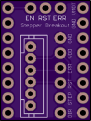
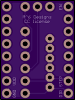

# Tarocco-compatible-Stepper-Driver-Breakout
(Untested) Breakout for the stepper drive interface (polulu carrier board) used in almost every 3d printer with replaceable Drivers.
Designed to be directly compatible with the control port on the Tarocco Servo Drive https://www.crowdsupply.com/citrus-cnc/tarocco but it can also be used for hooking up other external drivers.

The 3 pins at the top are to allow the use of a jumper to tie the error and reset together to stop motion when a fault occurs or to tie the enable pin to the reset and allow you to disable the Tarocco without removing power (useful for removing prints from a bed on a 3d printer).Currently this isn't supported by the Tarocco firmware but it would be an easy change. These pins are also useful for tying multiple driver error and reset lines together so they act as one.

